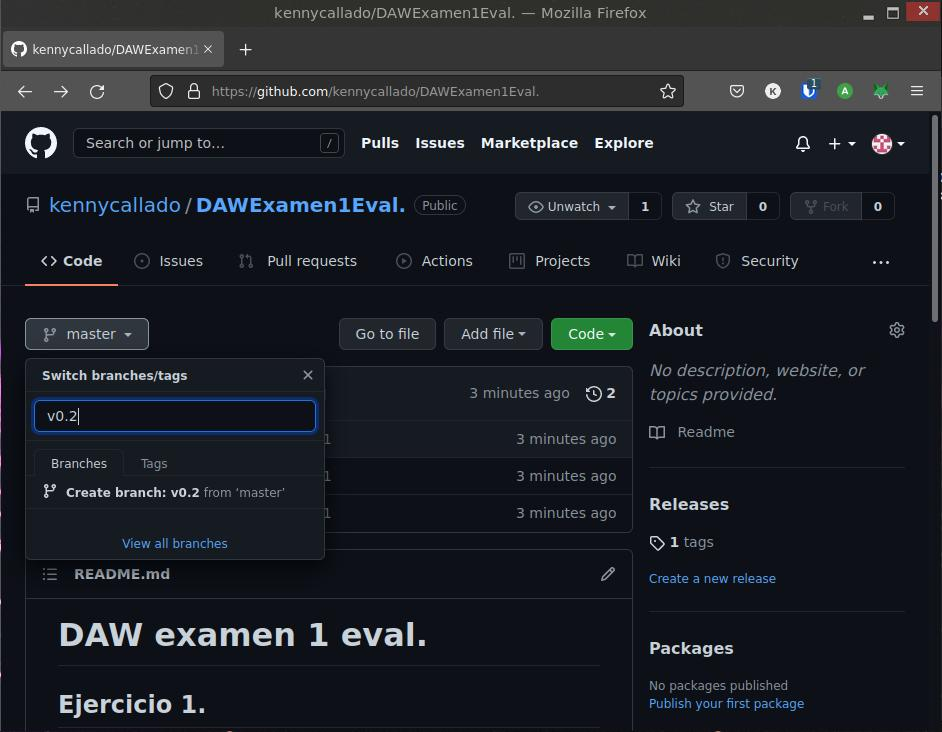
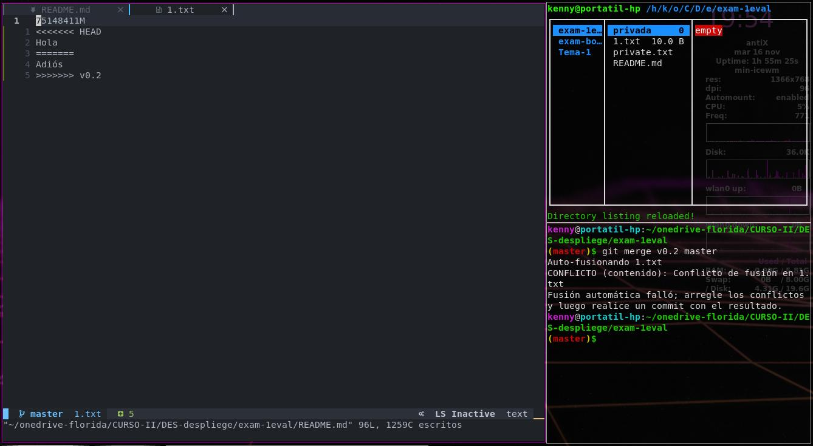
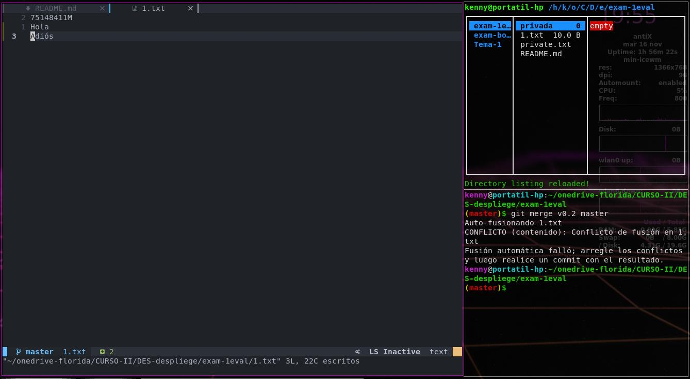

# DAW examen 1 eval.

## Ejercicio 1.

### a:

Lista de comandos usados hasta ahora:
- `git init`
- `touch README.md`
- `git add README.md`
- `git commit -m "Primer commit del examen"`
- `git remote add origin git@github.com:kennycallado/DAWExamen1Eval..git`
- `git push origin master`

### b:

- `git push origin master`

### c:

- `touch private.txt`

### d:

- `mkdir privada`

### e:

- `echo "private.txt" > .gitignore`
- `echo "privada" >> .gitignore`

### f:

- `echo "75148411M" > 1.txt`

### g:

- `git tag v1`

### h:

- `git add .`
- `git commit "Final ejercicio 1`
- `git push --tags origin master`

## Ejercicio 2.

### a:

- `git branch v0.2`
- `git checkout v0.2`

### b:

- `echo "16 de noviembre 2021 - 18:00" > 2.txt`

### c:

- Creo la rama en github:

- `git add.`
- `git commit -m "Commit en v0.2`

### d:

- `git checkout master`
- `git merge v0.2 master`

Actualizo remoto

- `git push origin master`

## Ejercicio 3.

### a:

- `echo "Hola" >> 1.txt`
- `git add .`
- `git commit -m "Agrega Hola al fichero 1.txt"`

### b:

- `git checkout v0.2`
- `echo "Adiós" >> 1.txt`
- `git add .`
- `git commit -m "Agrega Adiós al fichero 1.txt"`

### c:

- `git checkout master`
- `git merge v0.2 master`

- Al realizar el merge me aparece un conflicto lo gestiono con el editor aceptando ambos.

